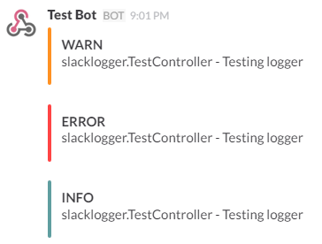

Slack Logger
=========

Slack Logger is a custom log4j appender which logs directly to a Slack channel.

<div style="text-align: center;">
	
</div>

## Requirements

- Slack account with Incoming WebHooks integration

## Setup

### Slack

- Create an [Incoming WebHooks integration](https://my.slack.com/services/new/incoming-webhook)
- Select a channel to post messages to
	- **NOTE:** This can be overwritten in the config. This is helpful if multiple projects use the same webhook.
- Add the WebHook url to the config as shown below

### Config

All config items contain the prefix **grails.plugin.slacklogger.**

**NOTE:** Config items with * after them are secret information. It is highly reccommended to put this information in secret files and pull it into the Grails project at runtime.

- **webhook** - The WebHook URL provided by Slack*
- **channel** - The channel to post to [Optional]
- **botName** - The name of the bot which the message will be posted as [Optional]
- **colors** - Map of colors which log attachments will be posted with [Optional]
	- **Default**
		```
        [
            INFO: '#5f9ea0',
            TRACE: '#6f6d6d',
            DEBUG: '#b5dae9',
            WARN: '#ff9122',
            ERROR: '#ff4444',
            FATAL: '#b03e3c'
        ]
    	```

## Use

**Slack Logger** creates a new **Log4j** appender which can be used like a normal appender in `Config.groovy`. Below is an example configuration of a new appender:

```
import com.theconnman.slacklogger.SlackAppender;
...
appenders {
    appender new SlackAppender(name: 'slackAppender', layout: pattern(conversionPattern: '%c{2} - %m%n'), threshold: org.apache.log4j.Level.INFO)
}
```

The appender pattern above will produce messages which look like the image at the top of the readme. Removing the time and the level from the log pattern is recommended because the time and level will appear on the Slack message by default.